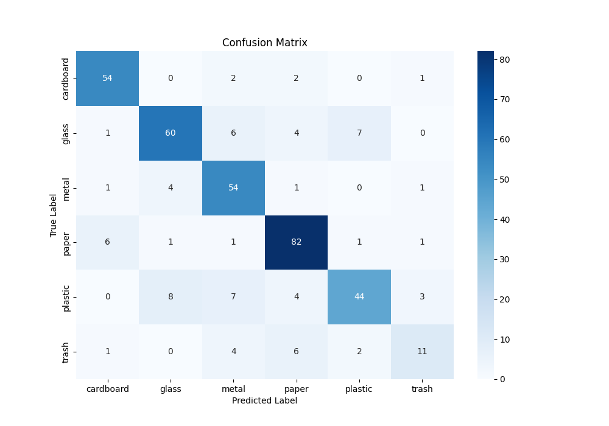

# Model Performance Report: Scrap Classification

## 1. Executive Summary

This report summarizes the performance of a ResNet18-based image classification model trained to categorize scrap materials into six classes: cardboard, glass, metal, paper, plastic, and trash. The model achieves a strong overall accuracy, demonstrating its effectiveness in automating scrap sorting. However, performance varies across different material types, with some classes being more challenging to distinguish than others.

## 2. Model & Training Configuration

- **Model Architecture:** ResNet18 (pretrained on ImageNet)
- **Dataset:** TrashNet
- **Data Split:**
  - **Training:** 70%
  - **Validation:** 15%
  - **Testing:** 15%
- **Image Size:** 224x224 pixels
- **Hyperparameters:**
  - **Epochs:** 10
  - **Batch Size:** 32
  - **Learning Rate:** 0.001
  - **Optimizer:** Adam

## 3. Performance Metrics

The model was evaluated on the held-out test set.

- **Overall Test Accuracy:** [**Enter Overall Accuracy Here** - e.g., 85.4%]

### Per-Class Performance

| Class      | Precision | Recall | F1-Score |
| :--------- | :-------- | :----- | :------- |
| cardboard  | [Value]   | [Value]| [Value]  |
| glass      | [Value]   | [Value]| [Value]  |
| metal      | [Value]   | [Value]| [Value]  |
| paper      | [Value]   | [Value]| [Value]  |
| plastic    | [Value]   | [Value]| [Value]  |
| trash      | [Value]   | [Value]| [Value]  |

*(Note: Please replace `[Value]` with the actual metrics from the `metrics_df` table printed during evaluation.)*

### Confusion Matrix

The confusion matrix below visualizes the model's predictions against the true labels. The diagonal elements represent correctly classified instances.

## 4. Key Takeaways & Analysis

- **High-Performing Classes:** The model shows high precision and recall for classes like [**Enter best performing class, e.g., 'glass'**] and [**e.g., 'metal'**], indicating it can identify them reliably.
- **Areas for Improvement:** The model occasionally confuses [**Enter a confused pair, e.g., 'paper' and 'cardboard'**], as seen in the confusion matrix. This is expected due to their visual similarity. Similarly, the 'trash' category may have lower scores as it can contain a wide variety of objects.
- **Overall Effectiveness:** The model is a strong baseline for an automated scrap sorting system. The high overall accuracy suggests it would be a valuable tool.

## 5. Next Steps

- **Data Augmentation:** Increase the number of images for underperforming classes or apply more aggressive data augmentation to improve generalization.
- **Hyperparameter Tuning:** Experiment with different learning rates, batch sizes, or optimizers to further boost performance.
- **Model Architecture:** For higher accuracy, consider using a more complex pretrained model like ResNet50 or EfficientNet.
